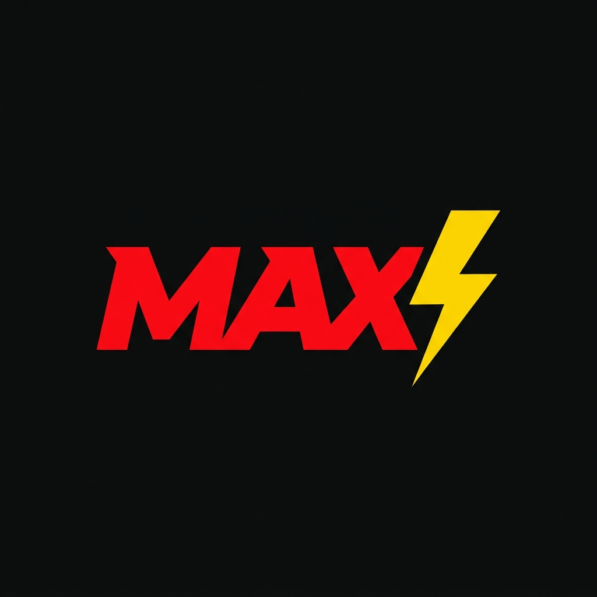

<div align="center">
  
  
  <h1>⚡ MAX - AI Desktop Assistant</h1>
  
  <p><strong>ULTRA-FAST, VOICE-CONTROLLED AI ASSISTANT FOR COMPLETE DESKTOP AUTOMATION</strong></p>
  
  <p>
    
    
    
    
    
  </p>
</div>

<hr/>

<h2 align="center"><em><strong>📖 Overview</strong></em></h2>

**MAX** is a lightweight, fully autonomous, voice-first desktop assistant designed to seamlessly translate natural human language into direct computer actions. 

Instead of just chatting, MAX acts as your hands. Powered by the lightning-fast **Groq API (Llama 3.3)**, it instantly understands your requests and executes over **80+ built-in operations** natively on your machine—from opening applications and navigating the web, to typing emails, managing files, and controlling system volume.

---

<h2 align="center"><em><strong>🚀 Key Features</strong></em></h2>

- 🎙️ **True Hands-Free Voice Mode:** Run in pure voice mode where MAX actively listens, converses, and executes without ever needing a mouse click or wake word.
- ⚡ **Lightning Fast Execution:** By leveraging Groq's high-speed inference, the delay between your voice command and the computer action is near-instantaneous.
- 📴 **Offline Speech Support:** Toggle to `faster-whisper` and `pyttsx3` in the config for fully offline Speech-to-Text and Text-to-Speech capabilities.
- 🛡️ **Military-Grade Safety:** A built-in shell sanitizer explicitly blocks destructive bash/cmd commands (like `rm -rf /` or disk wipes) to protect your operating system from AI hallucinations.

---

<h2 align="center"><em><strong>🧠 Core Architecture</strong></em></h2>

Unlike standard chatbot wrappers, MAX shifts heavy OS compute to local Python automation scripts:

1. **Strict JSON Routing:** The AI "Brain" uses a highly constrained system prompt. It forces the LLM to output exactly one JSON object containing the `tool` name and `params`, entirely bypassing conversational filler.
2. **Native Executor Bridge:** The parsed JSON routes directly to a massive dictionary mapping (`executor.py`), bridging the AI's intent with OS-level functions via `subprocess`, `os`, and `pyautogui`.
3. **Robust Fallbacks:** An advanced regex-based JSON extractor ensures that even if the AI wraps its output in markdown code blocks, the action will still execute flawlessly.
4. **Beautiful Tkinter GUI:** An optional, highly polished dark-mode dashboard provides real-time state visualization (Listening, Thinking, Speaking) and activity logging.

---

<h2 align="center"><em><strong>⚙️ The Pipeline Flow</strong></em></h2>

### 1️⃣ Input Phase
- **Listen:** You speak a command (e.g., *"Open Notepad and type Hello World"*).
- **STT:** Audio is transcribed to text instantly via Google STT or local Whisper.

### 2️⃣ Processing Phase
- **Context Injection:** The text is passed to the Groq API along with short-term conversation history.
- **Decision:** The LLM decides the best tool and responds with `{"tool": "type_text", "params": {"text": "Hello World"}}`.

### 3️⃣ Execution & Output Phase
- **Action:** `computer.py` takes over, simulating keyboard presses to type the exact text.
- **Confirmation:** The TTS engine speaks a brief confirmation (e.g., *"Done."*), and the interaction is logged locally in `data/history.json`.

---

<h2 align="center"><em><strong>💻 Setup & Usage</strong></em></h2>

Integrating and running MAX is incredibly straightforward.

```bash
# 1. Clone the repository
git clone https://github.com/yourusername/MAX.git
cd MAX

# 2. Install dependencies
pip install -r requirements.txt

# 3. Add your Groq API Key
# Create a .env file in the root directory:
echo "GROQ_API_KEY=gsk_your_key_here" > .env

# 4. Run MAX!
python run.py          # Runs pure voice mode
python run.py --gui    # Runs with the beautiful Dashboard
python run.py --text   # Runs in text-only terminal mode
```

### 💡 Example Commands
- *"Search Google for Python tutorials"*
- *"Play lofi hip hop on YouTube"*
- *"Take a screenshot"*
- *"Set volume to 50 percent"*
- *"Send a WhatsApp to Mom saying I'll be late"*

---

<h2 align="center"><em><strong>📂 File Structure</strong></em></h2>

```text
MAX/
│
├── run.py                  ← 🚀 Main launcher (GUI/Voice/Text)
├── max.py                  ← 🧠 Core agent loop & state orchestrator
├── config.py               ← ⚙️ Configuration (Engine choices, Wake word)
├── .env                    ← 🔑 API Keys (Ignored by Git)
│
├── core/
│   ├── brain.py            ← 🤖 Groq LLM integration & JSON parser
│   ├── speech.py           ← 🎙️ STT/TTS (Whisper, Google, pyttsx3)
│   └── logger.py           ← 📝 Local activity and history logging
│
├── tools/
│   ├── computer.py         ← 🖥️ 80+ OS-level Python automation functions
│   ├── browser.py          ← 🌐 Browser automation (Email, WhatsApp, etc)
│   └── executor.py         ← 🔀 Maps JSON decisions to Python tools
│
└── ui/
    └── dashboard.py        ← 🎨 Beautiful Tkinter UI & State Management
```

---

<div align="center">
  <i>Built for seamless desktop automation and hands-free productivity.</i>
</div>
